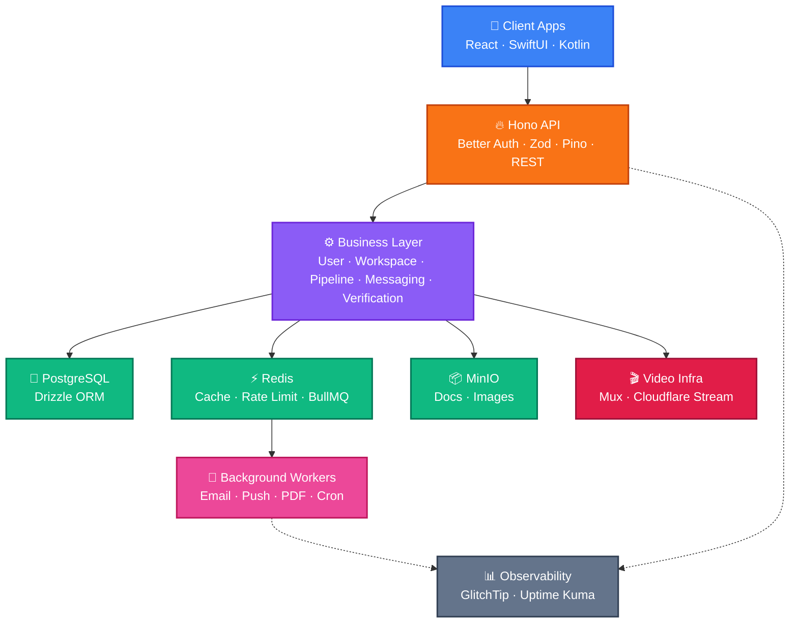
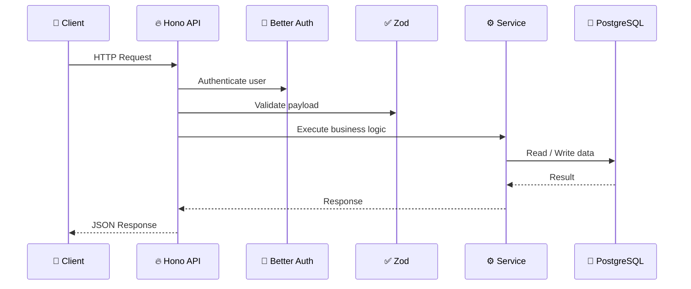
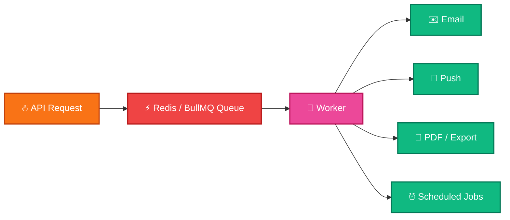
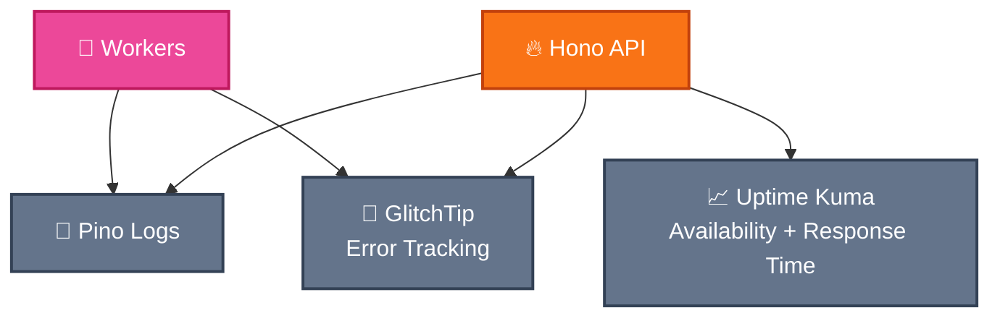
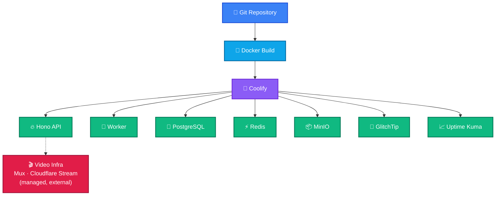

# MVP Backend Architecture

unicathlete-mvp

Technical stack & architecture for the UnicAthlete MVP

Hono • PostgreSQL • Redis • BullMQ • MinIO • Video Infra • GlitchTip • Uptime Kuma

---
layout: default
---

# Executive Summary

This document details the proposed technical stack and architecture for the
<b>UnicAthlete MVP</b>. The goal is a robust backend that meets four objectives:
rapid development, low infrastructure cost, an open-source focus, and scalability.

  Rapid development
  Low infrastructure cost
  Open-source focus
  Scalability

Strictly aligned with the confirmed MVP scope, the plan offers rational, cost-effective
solutions for <b>data integrity</b>, <b>personal & organization workspaces</b>,
<b>pipeline management</b>, and <b>secure interactions</b>. We avoided discredited
technologies like blockchain; instead we adopt modern approaches for structuring
<b>verifiable data</b>. To mitigate infrastructure risks, complex media handling like
<b>video processing</b> is offloaded to dedicated streaming solutions.

Full text

This document details the proposed technical stack and architecture for the UnicAthlete MVP (Minimum Viable Product). Our goal is to build a robust backend infrastructure that meets the objectives of rapid development, low infrastructure cost, an open-source focus, and scalability.

The plan is strictly aligned with the confirmed MVP scope, offering rational and cost-effective solutions for data integrity, personal and organization workspaces, pipeline management, and secure interactions. Notably, we avoided discredited technologies like blockchain; instead, we adopted modern approaches for structuring verifiable data. To mitigate infrastructure risks, complex media handling like video processing is offloaded to dedicated streaming solutions.

---
layout: default
---

# 1. Introduction

A core platform where <b>athletes</b> showcase their talents, and
<b>scouts / recruiters</b> discover, manage, and track potential talents through
structured <b>workspaces</b>.

  

    
Athletes

    
Showcase talent and build a verifiable performance profile.

  

  

    
Scouts / Recruiters

    
Discover, manage, and track potential talent through structured workspaces.

  

  Search
  Profiles
  Notes
  Messaging / Requests
  Basic verification

Full text

The UnicAthlete MVP is designed as a core platform where athletes can showcase their talents, and scouts/recruiters can discover, manage, and track potential talents through structured workspaces. This technical implementation plan explains the backend architecture of the MVP, the chosen technologies, and the rationale behind these choices. Our primary objective is to deliver immediate value by focusing strictly on the athlete and recruiter ecosystem (search, profiles, notes, messaging/requests, and basic verification) while establishing a clean and scalable structure for future phases.

---
layout: center
class: text-center
---

# Goal

Build a backend that is simple enough for MVP, but clean enough to scale.

  Fast development
  Low infrastructure cost
  Open-source first
  Easy deployment
  Type-safe backend
  Observable from day one

Deliver value quickly while establishing a clean, scalable structure that allows
for future growth and evolution.

---
layout: center
class: text-center
---

# 2. Architecture Overview

A modular, layered design where each component has a single responsibility and can
be developed and scaled independently.

Full text

The backend architecture of the UnicAthlete MVP is designed with a modular and layered approach. This structure ensures that each component has a specific responsibility and can be developed and scaled independently. The overall architecture consists of the following main layers: Client Apps, API Layer (Hono API), Business Layer, Data Layer (including a dedicated Video Infrastructure), Background Workers, and Observability.

---
layout: default
---

# Architecture Layers

  

    
Client Apps

    
User interfaces built with React (Web), SwiftUI (iOS), and Kotlin (Android).

  

  

    
API Layer — Hono

    
A fast, lightweight framework that connects client apps to backend services.

  

  

    
Business Layer

    
User management, workspace & project pipelines, messaging, requests, and basic verification workflows.

  

  

    
Data Layer

    
PostgreSQL (relational), Redis (cache & queue), MinIO (docs/images) + dedicated Video Infrastructure.

  

  

    
Background Workers

    
Async work: email, push, PDF/report exports, scheduled tasks.

  

  

    
Observability

    
GlitchTip (error tracking) and Uptime Kuma (service status) watch system health.

  

Full text

<b>Client Apps:</b> User interfaces developed using React (Web), SwiftUI (iOS), and Kotlin (Android).

<b>API Layer (Hono API):</b> A fast and lightweight API framework that facilitates communication between client applications and backend services.

<b>Business Layer:</b> Houses core business processes such as user management, workspace and project pipelines, messaging, requests, and basic verification workflows.

<b>Data Layer:</b> Includes components like PostgreSQL (relational database), Redis (caching and queue management), MinIO (for basic object storage like documents/images), and a dedicated Video Infrastructure for secure playback.

<b>Background Workers:</b> Asynchronously executes long-running operations such as email delivery, push notifications, PDF/report exports, and scheduled tasks.

<b>Observability:</b> GlitchTip (error tracking) and Uptime Kuma (service status monitoring) are used to monitor system health and performance.

---
layout: default
---

# 3. Core Technology Stack & Rationale

The stack is guided by five core principles:

  

    
Minimal moving parts

    
Reduce complexity, increase development speed.

  

  

    
Mostly open-source

    
Lower costs, benefit from community support.

  

  

    
Rapid development

    
Bring the MVP to market quickly within the confirmed scope.

  

  

    
Easy self-hosting

    
Keep infrastructure costs under control where applicable.

  

  

    
No premature microservices

    
Start monolithic; scale only when needed.

  

Full text

The technology stack selected for the UnicAthlete MVP is based on the following core principles:

<b>Minimal Moving Parts:</b> To reduce complexity and increase development speed.

<b>Mostly Open-Source:</b> To lower costs and benefit from community support.

<b>Rapid Development:</b> To bring the MVP to market quickly within the confirmed scope.

<b>Easy Self-Hosting:</b> To keep infrastructure costs under control where applicable.

<b>Avoiding Premature Microservices:</b> Starting with a monolithic structure to avoid unnecessary complexity, scaling only when needed.

---
layout: two-cols
---

# Core Stack

  
APIHono

  
ValidationZod

  
AuthBetter Auth

  
ORMDrizzle

  
DatabasePostgreSQL

  
Cache / QueueRedisBullMQ

  
StorageMinIO

  
LoggingPino

  
MonitoringGlitchTipUptime Kuma

::right::

# Why this stack?

  minimal moving parts
  mostly open-source
  fast to build
  easy to self-host
  no premature microservices
  strictly scoped for MVP

---
layout: default
---

# 3.1 API & Data Validation

  

    
Hono — API Framework

    
Lightweight, fast, web-standard-compliant. High performance even in edge environments — a perfect fit for rapid development and low resource consumption.

  

  

    
Zod — Data Validation

    
Schema-based validation fully compatible with TypeScript. Guarantees the reliability and type safety of API requests, catching errors at an early stage.

  

  

    
Better Auth — Authentication

    
Secure, scalable authentication. Manages user sessions and workspace authorization processes.

  

Full text

<b>Hono (API Framework):</b> A lightweight, fast, and web-standard-compliant API framework. It offers high performance even in edge environments.

<b>Zod (Data Validation):</b> A schema-based data validation library fully compatible with TypeScript. It ensures the reliability and type safety of incoming API requests and data structures.

<b>Better Auth (Authentication):</b> Provides secure and scalable authentication solutions, managing user sessions and workspace authorization processes.

---
layout: default
---

# 3.2 Data Management & Media Infrastructure

  

    
PostgreSQL — Database

    
Relational data: profiles, workspaces, pipelines, notes. Robust, reliable, and open-source.

  

  

    
Drizzle — ORM

    
Modern ORM with end-to-end TypeScript type safety. Simplifies database interactions.

  

  

    
Redis — Cache & Queue

    
High-performance key-value store: caching, rate limiting, and background jobs (BullMQ).

  

  

    
MinIO — Basic Object Storage

    
S3-compatible, strictly for lightweight files: profile images, documents, exported reports.

  

  

    
Dedicated Video Infrastructure — Mux · AWS MediaConvert · Cloudflare Stream

    
Reliable uploads, processing, compression, streaming, and secure playback — without the operational risks of self-hosting video.

  

Full text

<b>PostgreSQL (Database):</b> A robust, reliable, and open-source database for relational data (profiles, workspaces, pipelines, notes).

<b>Drizzle ORM (Object-Relational Mapper):</b> A modern ORM that provides end-to-end type safety with TypeScript, simplifying database interactions.

<b>Redis (Cache and Queue):</b> A high-performance key-value store utilized for caching, rate limiting, and managing background jobs (BullMQ).

<b>MinIO (Basic Object Storage):</b> An S3-compatible solution used strictly for storing lightweight files such as profile images, documents, and exported reports.

<b>Dedicated Video Infrastructure (e.g., Mux, AWS MediaConvert, or Cloudflare Stream):</b> To ensure reliable uploads, processing, compression, streaming, and secure playback without the heavy operational risks of self-hosting video infrastructure.

---
layout: center
class: text-center
---

# Request Flow

---
layout: center
class: text-center
---

# Background Jobs

Long-running tasks should not block API requests.

API returns fast. Workers process heavy tasks asynchronously.

<b>BullMQ</b> — a robust, Redis-based queue — decouples long-running operations from
API requests, while <b>Pino</b> provides fast, low-overhead structured logging.

Full text

<b>BullMQ (Message Queue):</b> A robust, Redis-based queue system for managing background jobs. It increases the system's responsiveness by decoupling operations (email delivery, PDF generation) from API requests.

<b>Pino (Logging):</b> A fast and low-overhead Node.js logging library for production environments.

<b>GlitchTip &amp; Uptime Kuma:</b> Open-source tools for real-time error tracking and service status monitoring.

---
layout: two-cols
---

# Redis Usage

  Cache
  Rate limiting
  BullMQ queue backend

::right::

# MinIO Usage

  Profile images
  Documents
  Exported reports
  Lightweight files only

Heavy media (video) is handled by dedicated streaming infrastructure — not MinIO.

---
layout: center
class: text-center
---

# Observability

For MVP, we keep monitoring simple: errors + uptime + structured logs.

<b>GlitchTip</b> — an open-source, Sentry-compatible platform — captures and reports
errors in real time, while <b>Uptime Kuma</b> tracks the availability and response
time of active services.

Full text

<b>GlitchTip (Error Tracking):</b> An open-source error tracking platform (Sentry compatible). It captures and reports errors in the application in real-time.

<b>Uptime Kuma (Service Status Monitoring):</b> An open-source, self-hostable service status monitoring tool. It tracks the uptime and performance of active services.

---
layout: default
---

# Trust & Media Strategy

Modern, pragmatic choices over hype — and offload risky infrastructure.

  

    
Blockchain

    
Discredited and unnecessarily costly for this use case — deliberately avoided.

  

  

    
Verifiable Data

    
Modern approaches for structuring verifiable data, protecting integrity without blockchain overhead.

  

  

    
Secure Interactions

    
Workspace-scoped authorization for messaging, requests, and basic verification.

  

  

    
Offloaded Video

    
Complex media (video processing) offloaded to dedicated streaming solutions to mitigate infrastructure risk.

  

Full text

Notably, we avoided discredited technologies like blockchain; instead, we adopted modern approaches for structuring verifiable data. To mitigate infrastructure risks, complex media handling like video processing is offloaded to dedicated streaming solutions (e.g., Mux, AWS MediaConvert, or Cloudflare Stream), ensuring reliable uploads, processing, compression, streaming, and secure playback.

---
layout: center
class: text-center
---

# What We Intentionally Exclude From MVP

  Microservices
  Kubernetes
  Event bus
  OpenTelemetry
  Prometheus / Grafana / Loki
  Distributed tracing

Less infrastructure. Faster MVP.

---
layout: center
class: text-center
---

# Deployment

---
layout: default
---

# 4. Conclusion

This plan builds the UnicAthlete MVP on a <b>robust, scalable, and cost-effective</b>
backend. By stripping away non-core functionalities and focusing purely on
<b>athletes</b>, <b>scouts / recruiters</b>, <b>workspaces</b>, and <b>secure media
handling</b>, this blueprint guarantees a rapid and stable go-to-market strategy.

The selected technologies support immediate MVP requirements while providing a solid
foundation for integrating <b>future roles and advanced features</b> when the platform
matures.

  Robust
  Scalable
  Cost-effective
  Focused scope

Full text

This technical implementation plan ensures that the UnicAthlete MVP is built upon a robust, scalable, and cost-effective backend infrastructure. By stripping away non-core functionalities and focusing purely on athletes, scouts/recruiters, workspaces, and secure media handling, this blueprint guarantees a rapid and stable go-to-market strategy. The selected technologies support immediate MVP requirements while providing a solid foundation for integrating future roles and advanced features when the platform matures.

---
layout: center
class: text-center
---

# Final Decision

Start simple. Stay open-source. Keep the architecture ready to scale.

Hono + PostgreSQL + Redis + BullMQ + MinIO + Video Infra + GlitchTip + Uptime Kuma

