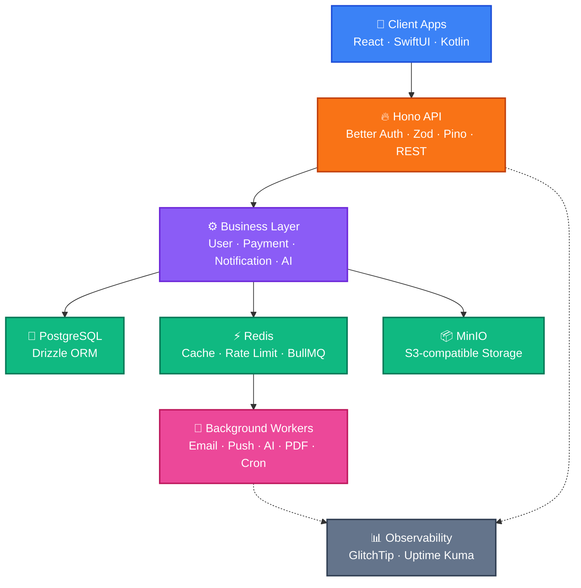
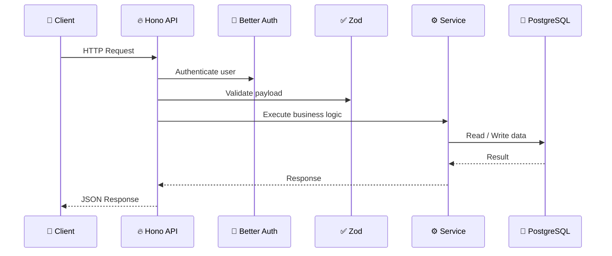
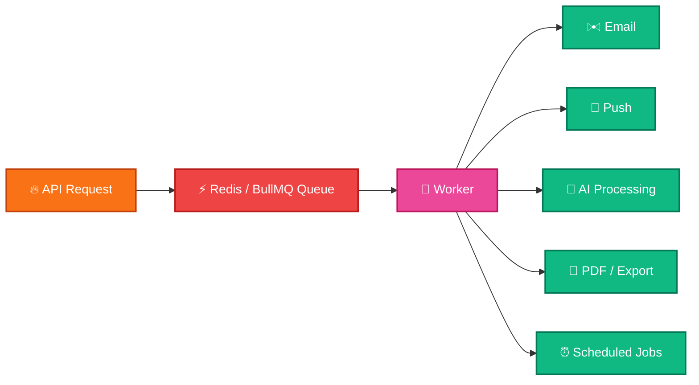
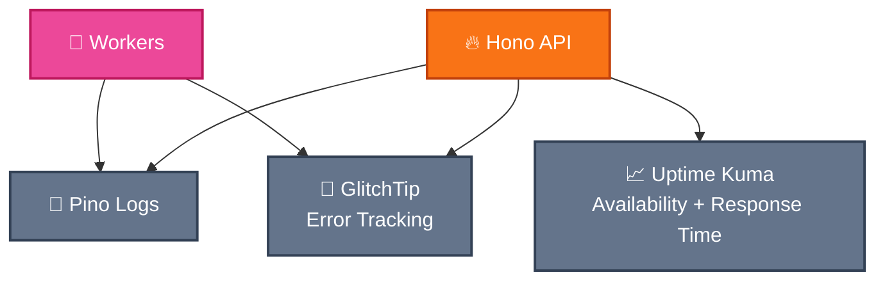
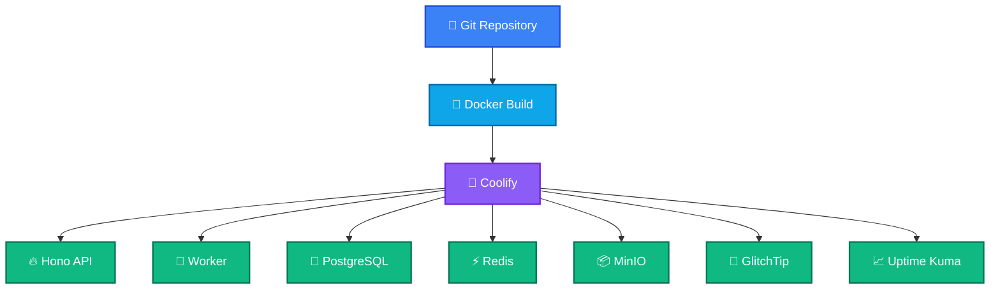

# MVP Backend Architecture

Modern, open-source focused, production-ready MVP stack

Hono • PostgreSQL • Redis • BullMQ • MinIO • GlitchTip • Uptime Kuma

---
layout: center
---

# Goal

Build a backend that is simple enough for MVP, but clean enough to scale.

  Fast development
  Low infrastructure cost
  Open-source first
  Easy deployment
  Type-safe backend
  Observable from day one

---
layout: center
---

# Architecture Overview

---
layout: two-cols
---

# Core Stack

  
APIHono

  
ValidationZod

  
AuthBetter Auth

  
ORMDrizzle

  
DatabasePostgreSQL

  
Cache / QueueRedisBullMQ

  
StorageMinIO

  
LoggingPino

  
MonitoringGlitchTipUptime Kuma

::right::

# Why this stack?

  minimal moving parts
  mostly open-source
  fast to build
  easy to self-host
  no premature microservices
  can scale later without rewriting

---
layout: center
---

# Request Flow

---
layout: center
---

# Background Jobs

Long-running tasks should not block API requests.

API returns fast. Workers process heavy tasks asynchronously.

---
layout: two-cols
---

# Redis Usage

  Cache
  Rate limiting
  BullMQ queue backend
  Temporary data
  Future WebSocket scaling

::right::

# MinIO Usage

  Images
  Documents
  Exports
  Attachments
  S3-compatible object storage

---
layout: center
---

# Observability

For MVP, we keep monitoring simple: errors + uptime + structured logs.

---
layout: center
---

# What We Intentionally Exclude From MVP

  Microservices
  Kubernetes
  Event bus
  OpenTelemetry
  Prometheus / Grafana / Loki
  Distributed tracing

Less infrastructure. Faster MVP.

---
layout: center
---

# Deployment

---
layout: center
class: text-center
---

# Final Decision

Start simple. Stay open-source. Keep the architecture ready to scale.

Hono + PostgreSQL + Redis + BullMQ + MinIO + GlitchTip + Uptime Kuma

