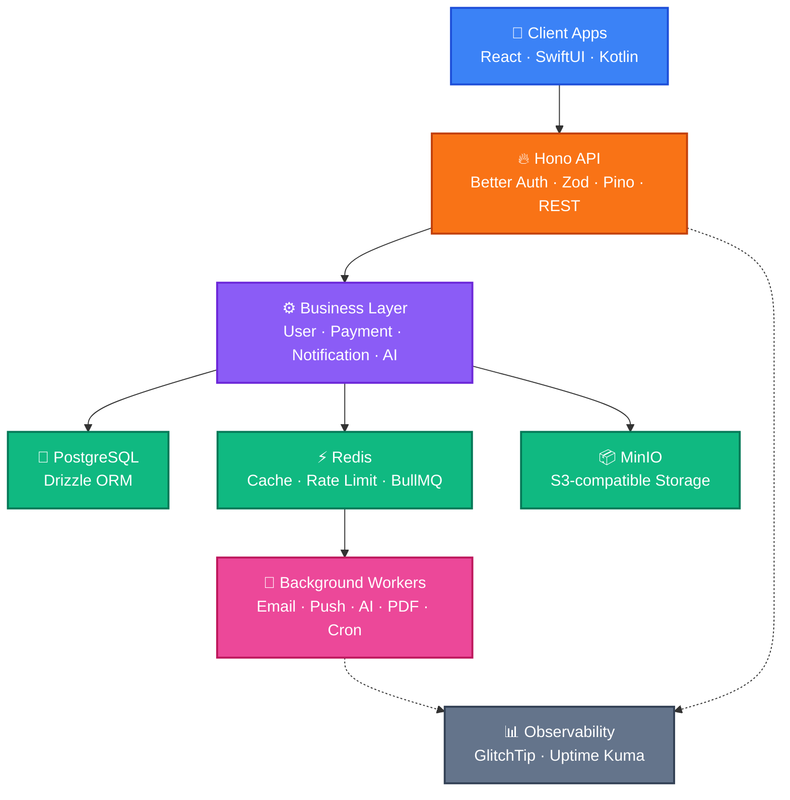
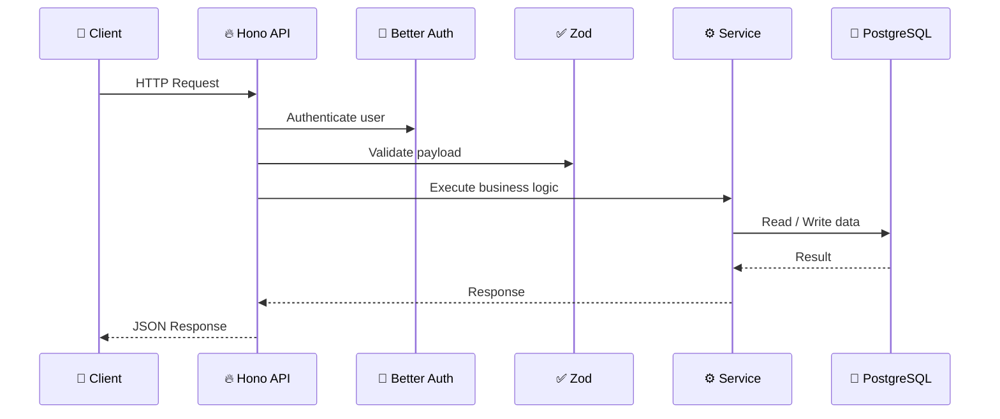
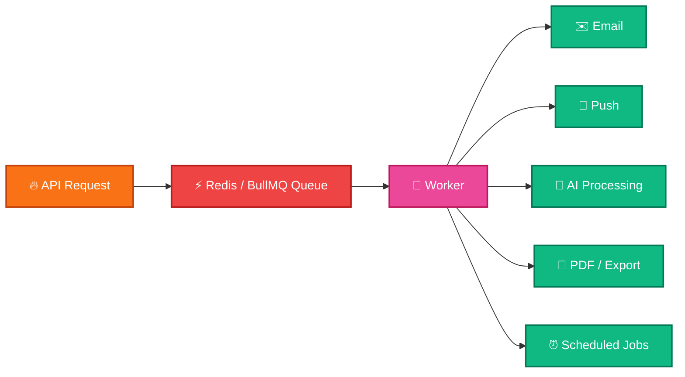
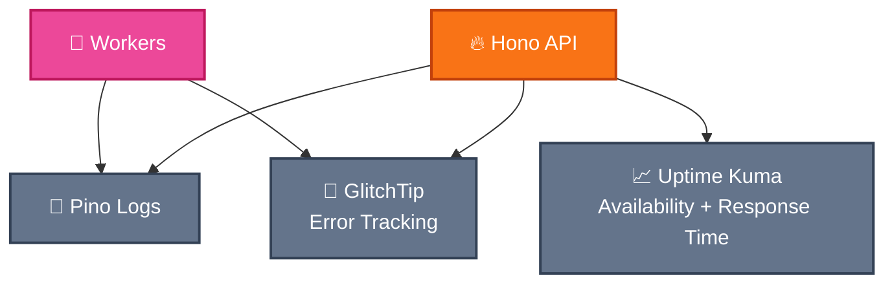
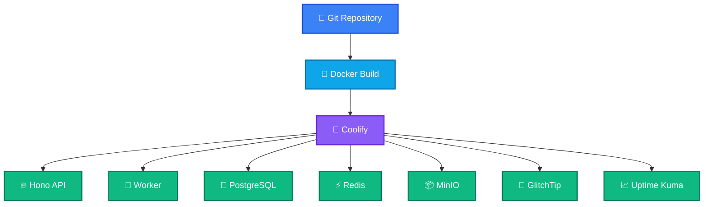

# MVP Backend Architecture

unicathlete-mvp

Technical stack & architecture for the UnicAthlete MVP

Hono • PostgreSQL • Redis • BullMQ • MinIO • GlitchTip • Uptime Kuma

---
layout: default
---

# Executive Summary

This document details the proposed technical stack and architecture for the
<b>UnicAthlete MVP</b>. The goal is a robust backend that meets four objectives:
rapid development, low infrastructure cost, an open-source focus, and scalability.

  Rapid development
  Low infrastructure cost
  Open-source focus
  Scalability

Aligned with the UnicAthlete concept, the plan offers rational, cost-effective
solutions in critical areas — <b>data integrity</b>, <b>gamification</b>, and
<b>AI integration</b>. Discredited technologies like blockchain are avoided; instead
we adopt modern, sustainable approaches such as <b>Immutable Ledgers</b> and
<b>Verifiable Credentials</b>. Due to cost sensitivity, video analysis is positioned
as the <b>final layer</b> of the verification process.

Full text

This document details the proposed technical stack and architecture for the UnicAthlete MVP (Minimum Viable Product). Our goal is to build a robust backend infrastructure that meets the objectives of rapid development, low infrastructure cost, an open-source focus, and scalability.

The plan, aligned with the current UnicAthlete concept, offers rational and cost-effective solutions in critical areas such as data integrity, gamification, and artificial intelligence integration. Notably, discredited technologies like blockchain have been avoided; instead, modern and sustainable approaches such as Immutable Ledgers and Verifiable Credentials have been adopted. Due to cost sensitivity, video analysis is positioned as the final layer of the verification process.

---
layout: default
---

# 1. Introduction

The UnicAthlete MVP is a platform where <b>athletes</b> showcase their talents,
<b>scouts</b> discover potential, and <b>coaches</b> track athlete development.

  

    
Athletes

    
Showcase talent and build a verifiable performance profile.

  

  

    
Scouts

    
Discover and evaluate emerging talent with trusted data.

  

  

    
Coaches

    
Track development over time and guide progression.

  

This plan explains the backend architecture, the chosen technologies, and the
rationale behind each choice. Primary objective: deliver value quickly on a clean,
scalable structure that supports future growth and evolution.

Full text

The UnicAthlete MVP is designed as a platform where athletes can showcase their talents, scouts can discover potential talents, and coaches can track athlete development. This technical implementation plan explains the backend architecture of the MVP, the chosen technologies, and the rationale behind these choices. Our primary objectives are to deliver value quickly while establishing a clean and scalable structure that allows for future growth and evolution.

---
layout: center
class: text-center
---

# Goal

Build a backend that is simple enough for MVP, but clean enough to scale.

  Fast development
  Low infrastructure cost
  Open-source first
  Easy deployment
  Type-safe backend
  Observable from day one

Deliver value quickly while establishing a clean, scalable structure that allows
for future growth and evolution.

---
layout: center
class: text-center
---

# 2. Architecture Overview

A modular, layered design where each component has a single responsibility and can
be developed and scaled independently.

Full text

The backend architecture of the UnicAthlete MVP is designed with a modular and layered approach. This structure ensures that each component has a specific responsibility and can be developed and scaled independently. The overall architecture consists of the following main layers: Client Apps, API Layer (Hono API), Business Layer, Data Layer, Background Workers, and Observability.

---
layout: default
---

# Architecture Layers

  

    
Client Apps

    
User interfaces built with React (Web), SwiftUI (iOS), and Kotlin (Android).

  

  

    
API Layer — Hono

    
A fast, lightweight framework that connects client apps to backend services.

  

  

    
Business Layer

    
Core processes: user management, payments, notifications, and AI integrations.

  

  

    
Data Layer

    
PostgreSQL (relational), Redis (cache & queue), MinIO (object storage).

  

  

    
Background Workers

    
Async work: email, push, AI processing, PDF/report exports, scheduled tasks.

  

  

    
Observability

    
GlitchTip (error tracking) and Uptime Kuma (service status) watch system health.

  

Full text

<b>Client Apps:</b> User interfaces developed using React (Web), SwiftUI (iOS), and Kotlin (Android).

<b>API Layer (Hono API):</b> A fast and lightweight API framework that facilitates communication between client applications and backend services.

<b>Business Layer:</b> Houses core business processes such as user management, payment processing, notifications, and AI integrations.

<b>Data Layer:</b> Includes components like PostgreSQL (relational database), Redis (caching and queue management), and MinIO (object storage).

<b>Background Workers:</b> Asynchronously executes long-running or intensive operations such as email delivery, push notifications, AI processing, PDF/report exports, and scheduled tasks.

<b>Observability:</b> GlitchTip (error tracking) and Uptime Kuma (service status monitoring) are used to monitor system health and performance.

---
layout: default
---

# 3. Core Technology Stack & Rationale

The stack is guided by six core principles:

  

    
Minimal moving parts

    
Reduce complexity, increase development speed.

  

  

    
Mostly open-source

    
Lower costs, benefit from community support.

  

  

    
Rapid development

    
Bring the MVP to market quickly.

  

  

    
Easy self-hosting

    
Keep infrastructure costs under control.

  

  

    
No premature microservices

    
Start monolithic; scale only when needed.

  

  

    
Scale without rewrites

    
Chosen tech natively supports future growth.

  

Full text

The technology stack selected for the UnicAthlete MVP is based on the following core principles:

<b>Minimal Moving Parts:</b> To reduce complexity and increase development speed.

<b>Mostly Open-Source:</b> To lower costs and benefit from community support.

<b>Rapid Development:</b> To bring the MVP to market quickly.

<b>Easy Self-Hosting:</b> To keep infrastructure costs under control.

<b>Avoiding Premature Microservices:</b> Starting with a monolithic structure to avoid unnecessary complexity, scaling only when needed.

<b>Scalability Without Rewrites:</b> Ensuring that initially selected technologies can natively support future growth.

---
layout: two-cols
---

# Core Stack

  
APIHono

  
ValidationZod

  
AuthBetter Auth

  
ORMDrizzle

  
DatabasePostgreSQL

  
Cache / QueueRedisBullMQ

  
StorageMinIO

  
LoggingPino

  
MonitoringGlitchTipUptime Kuma

::right::

# Why this stack?

  minimal moving parts
  mostly open-source
  fast to build
  easy to self-host
  no premature microservices
  can scale later without rewriting

---
layout: default
---

# 3.1 API & Data Validation

  

    
Hono — API Framework

    
Lightweight, fast, web-standard-compliant. High performance even in edge environments — a perfect fit for rapid development and low resource consumption.

  

  

    
Zod — Data Validation

    
Schema-based validation fully compatible with TypeScript. Guarantees the reliability and type safety of API requests, catching errors at an early stage.

  

  

    
Better Auth — Authentication

    
Secure, scalable authentication. Manages user sessions and authorization processes.

  

Full text

<b>Hono (API Framework):</b> A lightweight, fast, and web-standard-compliant API framework. It offers high performance even in edge environments. It aligns perfectly with our goals of rapid development and low resource consumption.

<b>Zod (Data Validation):</b> A schema-based data validation library fully compatible with TypeScript. It ensures the reliability and type safety of incoming API requests and data structures, catching errors at an early stage.

<b>Better Auth (Authentication):</b> Provides secure and scalable authentication solutions. It manages user sessions and authorization processes.

---
layout: default
---

# 3.2 Data Management

  

    
PostgreSQL — Database

    
Robust, reliable, open-source relational database. A secure long-term choice with strong scalability and community support.

  

  

    
Drizzle — ORM

    
Modern ORM with end-to-end TypeScript type safety. Simplifies database interactions and boosts efficiency.

  

  

    
Redis — Cache & Queue

    
High-performance key-value store: caching, rate limiting, BullMQ backend, ephemeral data, future WebSocket scaling.

  

  

    
MinIO — Object Storage

    
S3-compatible, open-source storage for images, documents, and exports. Cloud-provider independence and cost efficiency.

  

Full text

<b>PostgreSQL (Database):</b> A robust, reliable, and open-source database for relational data. Thanks to its extensive feature set, scalability, and robust community support, it represents a secure long-term solution.

<b>Drizzle ORM (Object-Relational Mapper):</b> A modern ORM that provides end-to-end type safety with TypeScript. It simplifies database interactions and increases development efficiency.

<b>Redis (Cache and Queue):</b> A high-performance key-value store. It will be utilized for Caching (reduces database load and speeds up response times), Rate Limiting (controls request rates to prevent API abuse), BullMQ Queue Backend (manages background jobs), Ephemeral Data Storage (fast storage for short-lived data), and Future WebSocket Scaling (foundation for real-time communication).

<b>MinIO (Object Storage):</b> An S3-compatible, open-source object storage solution. It is used for storing large files such as images, documents, exported reports, and other attachments. It provides cloud provider independence and cost efficiency.

---
layout: center
class: text-center
---

# Request Flow

---
layout: center
class: text-center
---

# Background Jobs

Long-running tasks should not block API requests.

API returns fast. Workers process heavy tasks asynchronously.

<b>BullMQ</b> — a robust, Redis-based queue — decouples long-running operations from
API requests, while <b>Pino</b> provides fast, low-overhead structured logging.

Full text

<b>BullMQ (Message Queue):</b> A robust, Redis-based queue system for managing background jobs. It increases the system's responsiveness by decoupling long-running operations (email delivery, AI processing, PDF generation) from API requests.

<b>Pino (Logging):</b> A fast and low-overhead Node.js logging library. It provides highly performant logging for production environments.

---
layout: two-cols
---

# Redis Usage

  Cache
  Rate limiting
  BullMQ queue backend
  Temporary data
  Future WebSocket scaling

::right::

# MinIO Usage

  Images
  Documents
  Exports
  Attachments
  S3-compatible object storage

---
layout: center
class: text-center
---

# Observability

For MVP, we keep monitoring simple: errors + uptime + structured logs.

<b>GlitchTip</b> — an open-source, Sentry-compatible platform — captures and reports
errors in real time, while <b>Uptime Kuma</b> tracks the availability and response
time of active services.

Full text

<b>GlitchTip (Error Tracking):</b> An open-source error tracking platform (Sentry compatible). It captures and reports errors in the application in real-time.

<b>Uptime Kuma (Service Status Monitoring):</b> An open-source, self-hostable service status monitoring tool. It tracks the uptime and performance of active services.

---
layout: default
---

# Trust & Verification

We chose modern, sustainable approaches over hype — no blockchain.

  

    
Blockchain

    
Discredited and unnecessarily costly for this use case — deliberately avoided.

  

  

    
Immutable Ledgers

    
Tamper-evident records that protect data integrity without blockchain overhead.

  

  

    
Verifiable Credentials

    
Cryptographically verifiable claims for trusted athlete achievements.

  

  

    
Video Analysis — final layer

    
Due to cost sensitivity, positioned as the last step of the verification process.

  

Full text

Notably, discredited technologies like blockchain have been avoided; instead, modern and sustainable approaches such as Immutable Ledgers and Verifiable Credentials have been adopted. These protect data integrity without blockchain overhead and provide cryptographically verifiable claims for trusted athlete achievements. Due to cost sensitivity, video analysis is positioned as the final layer of the verification process.

---
layout: center
class: text-center
---

# What We Intentionally Exclude From MVP

  Microservices
  Kubernetes
  Event bus
  OpenTelemetry
  Prometheus / Grafana / Loki
  Distributed tracing

Less infrastructure. Faster MVP.

---
layout: center
class: text-center
---

# Deployment

---
layout: default
---

# 4. Conclusion

This plan builds the UnicAthlete MVP on a <b>robust, scalable, and cost-effective</b>
backend. The selected technologies and architectural approaches support rapid
development and future growth, while remaining critical to achieving
<b>data integrity</b> and <b>optimal user interaction</b>.

This blueprint positions UnicAthlete as an innovative and structurally sound platform
in the field of <b>sports talent discovery and development</b>.

  Robust
  Scalable
  Cost-effective
  Data integrity

Full text

This technical implementation plan ensures that the UnicAthlete MVP is built upon a robust, scalable, and cost-effective backend infrastructure. The selected technologies and architectural approaches support rapid development and future growth while being critical to achieving data integrity and optimal user interaction goals. This blueprint will help position UnicAthlete as an innovative and structurally sound platform in the field of sports talent discovery and development.

---
layout: center
class: text-center
---

# Final Decision

Start simple. Stay open-source. Keep the architecture ready to scale.

Hono + PostgreSQL + Redis + BullMQ + MinIO + GlitchTip + Uptime Kuma

